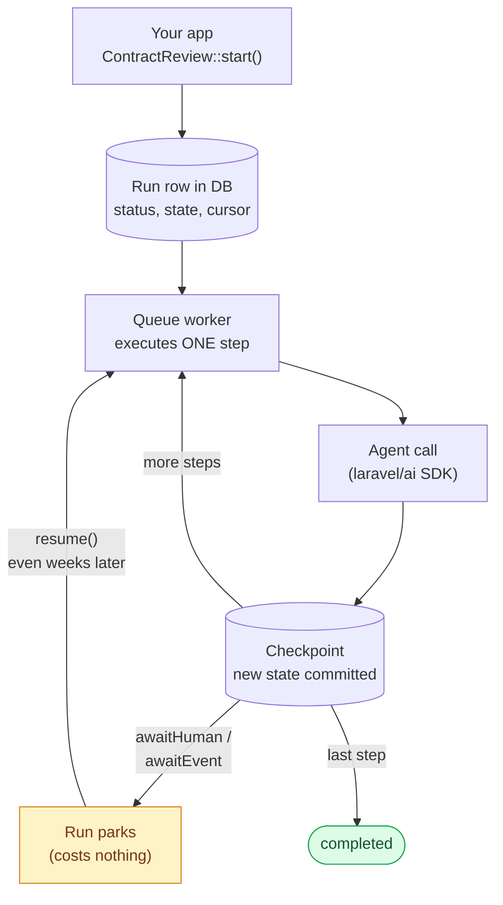
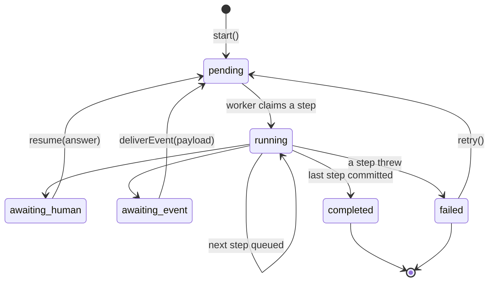
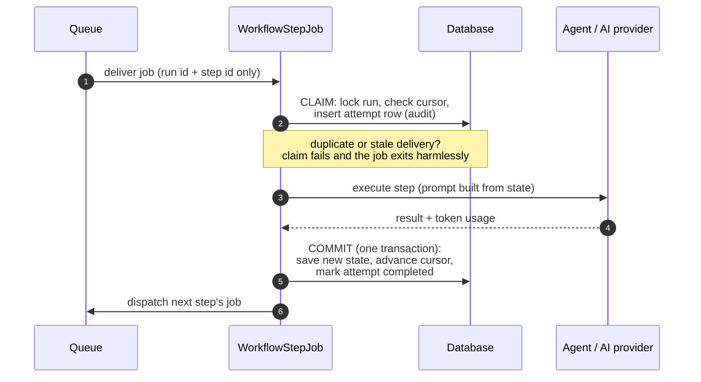
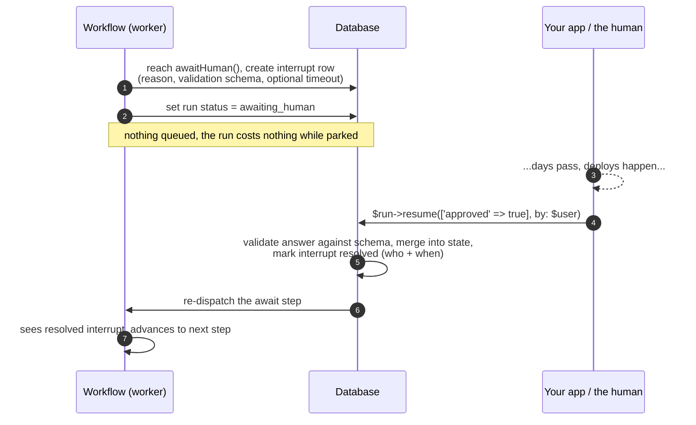
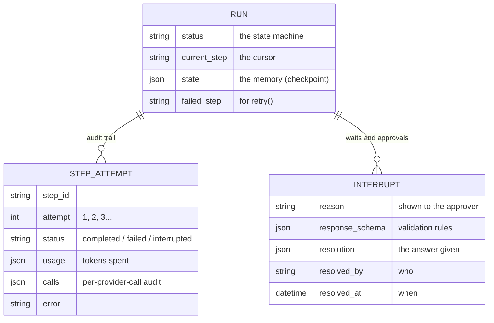
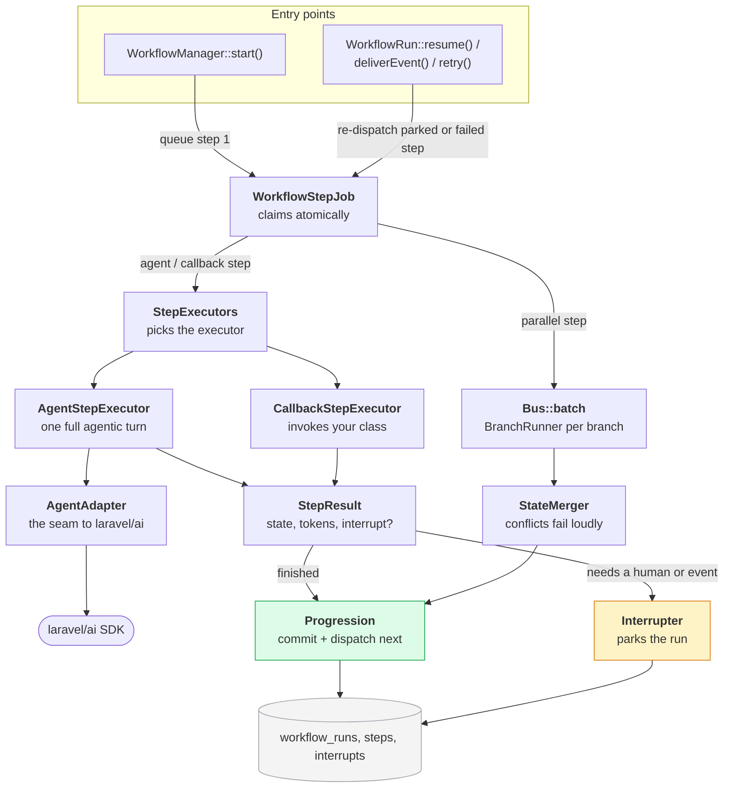

# How It Works

- [Introduction](#introduction)
- [The Big Picture](#the-big-picture)
- [The Life of a Run](#the-life-of-a-run)
- [Inside One Step](#inside-one-step)
- [Waiting for a Human](#waiting-for-a-human)
- [What's in the Database](#whats-in-the-database)
- [The Three Layers](#the-three-layers)
- [Who Does What](#who-does-what)

## Introduction

This page explains the engine underneath the definition API: how a run executes, why a crash never loses work, and what actually lives in your database. You do not need any of it to build workflows, but it is the page to read when you want to trust the machine.

> [!NOTE]
> **The one idea everything follows from:** a workflow's memory lives in the *database*, not in the PHP process. Each step runs as its own queued job, and the run's state is checkpointed after every step, so the process can crash, deploy, or wait a week for a human and pick up exactly where it left off.

## The Big Picture

Your app calls `SomeWorkflow::start()`, which does nothing but insert a run row and queue the first step. From there a loop drives everything: a queue worker executes one step, commits a checkpoint, and queues the next, until the workflow finishes, fails, or parks itself to wait.

Because every arrow into "Checkpoint" is a database commit, a failure at step 5 never re-runs (or re-bills) steps 1 through 4. `$run->retry()` re-queues only the failed step.

The step types themselves (`step`, `when`, `parallel`, `evaluate`, `debate`, `awaitHuman`, `awaitEvent`) are documented in [Defining Workflows](defining-workflows.md). They compose in one straight line; there are no arbitrary graphs. Structural steps carry their branches and bodies as plain child steps, and `debate()` compiles to an `evaluate()` loop.

## The Life of a Run

A run is a state machine stored in one database row. Only the statuses below exist, and every transition is a guarded, transactional update, so two workers (or two double-clicked approve buttons) can never both win.

`cancel()` works from any non-terminal status (including `failed`) and resolves open waits. While parked, a run survives deploys, restarts, and weekends. It is just a row with an open interrupt record attached, waiting for someone to answer.

## Inside One Step

The engine has exactly one moving part: `WorkflowStepJob`. Its payload carries only two ids, the run and the step, so state is always loaded fresh from the last checkpoint, never from a possibly-stale job payload.

Crash-safety falls out of the claim/commit pair. Crash *before* the commit and nothing changed; the step simply re-runs from the same checkpoint. Crash *after* and the result is already durable. The conditional "advance only if the cursor is still on this step" update means at most one completion ever moves the run forward.

## Waiting for a Human

This is the thing a plain request cycle cannot do. Instead of blocking a process, the engine writes down *what it is waiting for* and stops queueing work entirely.

The same mechanism absorbs the SDK's [tool-approval flow](human-in-the-loop.md#tool-approvals): an agent step that pauses on a tool approval parks the run as `awaiting_human`, and `resume()` replays the decisions into the paused conversation. `awaitEvent()` is the machine-to-machine twin, woken by `deliverEvent()`.

## What's in the Database

Three tables carry everything: the run (current truth), its step attempts (the audit trail, one row per attempt including failures), and its interrupts (every wait and who answered it).

Everything is a plain Eloquent model, so your dashboards and reports are ordinary queries: `$run->steps` for timings and token bills, `$run->interrupts` for who approved what and when. Each run also stores a hash of its definition, so a deploy that changes a workflow refuses to resume old in-flight runs by default. See [definition drift](defining-workflows.md#definition-drift).

## The Three Layers

The codebase splits into three layers. The **blueprint** is rebuilt from your code at boot on every process and never stored: your `Workflow` subclass assembles a `WorkflowDefinition`, an ordered list of immutable `StepDefinition` objects. The **records** are three Eloquent models, the only durable truth. The **engine** is a set of stateless services that read records, consult the blueprint, and write records. Nothing else holds state, which is why any worker on any server can pick up any step.

Two details worth noticing. The job's payload carries only a run id and a step id, so state is always reloaded from the checkpoint and a retried job can never see stale memory. And every write path ends in a *conditional* update ("advance only if the cursor is still on this step"), so duplicate deliveries and racing workers resolve to exactly one winner, with the loser's audit row keeping its token bill.

## Who Does What

| Class | Responsibility |
| --- | --- |
| **The blueprint** (built from code at boot, never stored) | |
| `Workflow` | The class you write: `build()` declares the steps, `name()` registers the kebab-cased name, and static `start()` is the entry point. |
| `WorkflowDefinition` | The builder and the finished blueprint in one: derives unique step ids, answers "what runs after step X", and hashes its structure so [drift](defining-workflows.md#definition-drift) is detectable. |
| `StepDefinition` + subclasses | Immutable descriptions of one step each. The structural ones carry nested child steps, and `DebateRoundDefinition` is a multi-agent `evaluate` body. |
| `WorkflowRegistry` / `WorkflowManager` | The boot-time name-to-definition map on every process, and the starter that inserts the run row (singleton keys enforced by a unique index) and queues step 1. |
| **The records** (Eloquent models, the only durable truth) | |
| `Models/WorkflowRun` | The run row (status, cursor, state checkpoint) and the imperative API: `resume()`, `deliverEvent()`, `retry()`, `cancel()`, `progress()`. Each is a locked, guarded transition. |
| `Models/WorkflowStep` | The audit trail: one row per *attempt* of every step, with timings, token usage, [per-call detail](runs-and-observability.md#per-call-audit), and errors. |
| `Models/WorkflowInterrupt` | One row per wait: the reason, the validation schema, and later the resolution (who answered, what, and when). |
| **The engine** (stateless services, one job each) | |
| `Jobs/WorkflowStepJob` | The one moving part: atomically claims a step, then routes to the right handler for the step's type. |
| `Steps/AgentStepExecutor` / `CallbackStepExecutor` | Do the actual work: one full agentic turn with prompt resolution and approval replay, or one invocation of your plain class. |
| `Support/AgentAdapter` | The single seam to `laravel/ai`: projects SDK responses into a stable result so the fast-moving 0.x SDK breaks in one file, not everywhere. |
| `Runtime/Progression` / `Interrupter` | The commit and the park: one conditional transaction to advance, or one interrupt write to wait (dispatching nothing, so a parked run costs nothing). |
| `Runtime/ParallelStepCompleter` + `StateMerger` | When a fan-out's batch settles, merge branch states. Conflicting writes to the same key fail the run rather than losing data. |
| `Runtime/DriftGuard` / `GroupSettler` | Refuses to advance drifted runs, and fires `WorkflowGroupSettled` exactly once when a [group's](runs-and-observability.md#run-groups) last run finishes. |
| `Console/SweepCommand` / `Testing/WorkflowFake` | The safety nets: a [scheduled sweeper](operations.md#the-sweeper) for dead workers and expired timeouts, and [fakes](testing.md) for really-executing workflow tests. |
